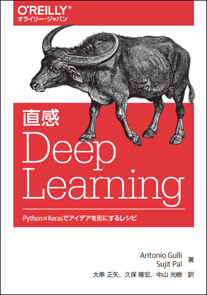

# 直感 Deep Learning

---



---

本リポジトリはオライリー・ジャパン発行書籍『[直感 Deep Learning](http://www.oreilly.co.jp/books/9784873118260/)』（原書名『[Deep Learning with Keras](https://www.packtpub.com/big-data-and-business-intelligence/deep-learning-keras)』）のサポートサイトです。

## サンプルコード

### ファイル構成

|フォルダ名 |説明                         |
|:--        |:--                          |
|ch01       |1章で使用するソースコードとライブラリ導入に必要なrequirements.txt    |
|ch02       |2章で使用するソースコードとライブラリ導入に必要なrequirements.txt     |
|...        |...                          |
|ch08       |8章で使用するソースコードとライブラリ導入に必要なrequirements.txt     |

サンプルコードの解説は本書籍をご覧ください。

## 仮想環境の準備

環境構築の方法は読者に任せていますが、一般的には仮想環境を構築する方法を推奨されるのでその方法を記述しておきます。

`pyenv`と`virtualenv`の導入をします。

linux
```
apt-get install pyenv
apt-get install virtualenv
```
Mac
```
brew install pyenv
brew install virtualenv
```

`pyenv`と`virtualenv`を用いて仮想環境を構築します。

```
pyenv install 3.6.0
pyenv rehash
pyenv local 3.6.0
virtualenv -p ~/.pyenv/versions/3.6.0/bin/python3.6 my_env
source my_env/bin/activate

```

Windows

[Miniconda](https://conda.io/miniconda.html)を導入して下さい

```
conda create -n anomaly python=3 numpy scipy scikit-learn pandas matplotlib statsmodels jupyter
activate anomaly
pip install beautifulsoup4 lxml
````

### 使用方法

サンプルを実行する前に、必要なライブラリをインストールする必要があります。

```bash
$ pip install -r requirements.txt
```

CPU用の`requirements.txt`とGPU用の`requirements_gpu.txt`を章ごとに用意してあります。

> 巻末の付録Aで、GPUを考慮した開発環境の構築について補足していますので参考にしてください。

各章のフォルダへ移動して、Pythonコマンドを実行します。書籍にどのpythonコードを動作させているか明記しています。
下記は一例です。

```
cd ch03
python cifar10_deep_with_aug.py
```

## 実行環境

日本語版で検証に使用した各ソフトウェアのバージョン、およびハードウェアは次のとおりです。

#### ソフトウェア

* Pycharm-community-2017.1
* Python 3.6.0（10章ではDocker環境での簡易的な確認のため3.5.2）
* TensorFlow 1.8.0
* Keras 2.1.6（4章では他のライブラリとの関係があるため2.1.2）
* h5py 2.7.1
* numpy 1.14.0
* scipy 1.0.0
* quiver-engine 0.1.4.1.4
* matplotlib 2.1.1
* picklable\_itertools 0.1.1以上
* sacred 0.6.10以上
* tqdm 4.8.4以上
* q 2.6以上
* gensim 3.2.0
* nltk 3.2.5
* scikit-learn 0.19.1
* pandas 0.22.0
* Pillow 4.3.0
* gym 0.10.5
* pygame 1.9.3
* html5lib 0.9999999
* keras-adversarial 0.0.3
* PyYAML 3.12
* requests 2.14.2

##### GPUを使用する場合

* tensorflow-gpu 1.8.0
* cuda 9.0
* cuDNN 7.0.5

#### 動作確認済みハードウェア

 * Ubuntu 16.04 LTS（GPU：GeForce GTX 1080）
 * 64ビットアーキテクチャ
 * Intel(R) Core(TM) i7-6700 CPU @ 3.40GHz
 * 16GBのRAM
 * ハードディスクの空き容量は少なくとも10GB

## 正誤表

まだありません。誤植など間違いを見つけた方は、japan@oreilly.co.jpまでお知らせください。
